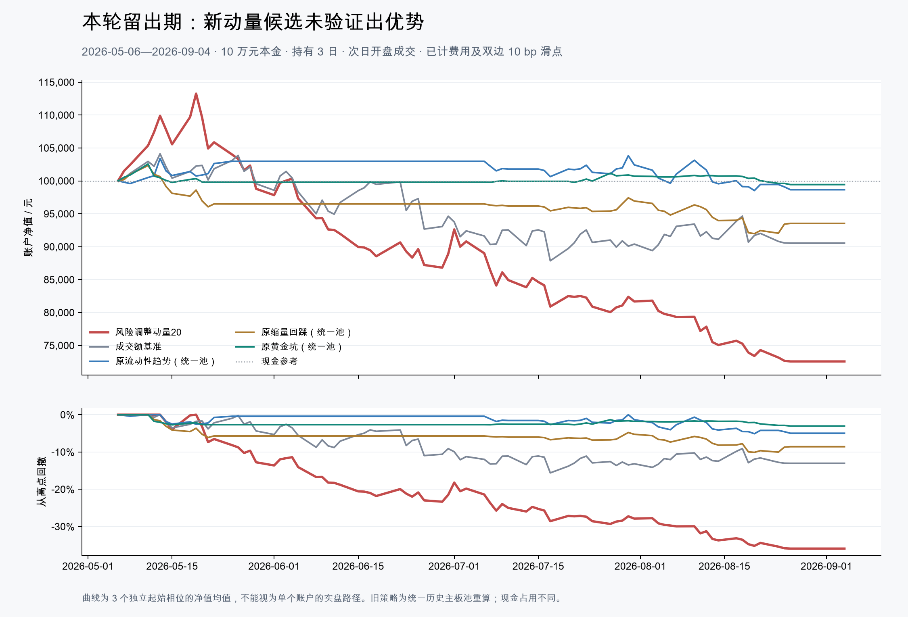

# 观澜短线策略研究 · 2026-09-05

**本轮没有找到证据足够、更适合上线的 1–5 日新策略。** 八种公开研究启发的简单候选均未通过事先规定的开发门槛；选择期排名最高的“20 日风险调整动量”在最后区间仍明显亏损，不能作为改进版加入 App。现有模型也不因此变成已验证盈利策略。

用户确认本金 **100,000 元**。行情快照截至 **2026-09-04**，版本 `20260904-c0eccf474694bb2b`。本报告是资金约束回测，与 App 目前的逐信号事件收益口径不同。

## 最后区间的同口径比较

2026-05-06—09-04，共 87 个交易日；末尾 11 个信号日剔除，保留 76 个可发信号日。每次最多 5 只，持有 3 个交易日后开盘尝试卖出。扣佣金、税费及买卖各 10 bp 滑点。三个起始相位分别使用独立 10 万元账户，表中净收益取账户终值平均，回撤取均值曲线；成交笔数合并三个相位，不代表一个账户做了同样多笔交易，也不是独立同分布样本。

| 策略 | 净收益 | 平仓胜率 | 均值曲线最大回撤 | 平均资金占用 | 平仓笔数 |
|---|---:|---:|---:|---:|---:|
| 风险调整动量20 | -27.43% | 35.75% | 35.93% | 75.26% | 358 |
| 成交额基准 | -9.46% | 41.50% | 15.61% | 60.70% | 306 |
| 原流动性趋势（统一池） | -1.34% | 44.58% | 5.11% | 34.17% | 166 |
| 原缩量回踩（统一池） | -6.46% | 41.33% | 10.11% | 32.70% | 150 |
| 原黄金坑（统一池） | -0.56% | 53.19% | 3.05% | 10.18% | 47 |

新候选的三个账户分别为 -31.22%, -39.36%, -11.71%，单账户最差回撤 47.06%；平均终值 **72,569 元**。并非只输在选错某一个换仓起点。

黄金坑胜率 53.19%，但“总盈利金额 / 总亏损金额”只有 **0.91**，平均终值 **99,435 元**，说明“赢的次数较多”不等于赚钱。它只有 47 笔平仓、平均仅约一成资金在场，不能把较低回撤直接当作相同风险下的优势。

旧策略在本报告中只保留原有选股逻辑，统一为历史沪深主板池、Top5 和相同账本；去掉当前行业限额，不是 App 原先 Top10 事件研究的复述。成交额基准是同一基础池中成交额最高的 5 只按相同频率换仓，**不是沪深 300 或全市场指数**。候选平均持仓 75.26%、基准 60.70%，相对差包含市场暴露不同的影响；不能声称等仓位跑输。现金不计息，收益参考为 0。

## 八种思路怎样选型

开发期为 2025-05-06—12-31，选择期为 2026-01-05—04-30。只用这两段选择候选；最后区间只打开一个预先封存的新候选及预先指定的旧策略对照，没有再查看另外七项的最后区间结果。

| 新候选 | 开发期净收益 | 选择期净收益 | 选择期胜率 | 开发门槛 |
|---|---:|---:|---:|---|
| 流动性低波动20 | -12.15% | -7.12% | 34.85% | 未通过 |
| 流动性低波动60 | -14.05% | -10.53% | 30.91% | 未通过 |
| 风险调整动量20 | -25.32% | +2.58% | 45.22% | 未通过 |
| 风险调整动量60 | -6.34% | +1.99% | 48.69% | 未通过 |
| 趋势内三日反转 | -22.23% | -13.04% | 39.30% | 未通过 |
| 趋势内五日反转 | -10.53% | -9.45% | 42.28% | 未通过 |
| 低波动三日回撤 | -8.13% | -7.84% | 42.99% | 未通过 |
| 二十日放量突破 | -14.03% | -19.92% | 38.33% | 未通过 |

“20 日风险调整动量”只是选择期日超额信息比率最高的**诊断对象**，此前已未通过开发门槛，并非提前认定的赢家。其规则：在满足历史基础条件、20 日成交额位于前 40% 的主板股票中，要求收盘价高于 MA60、20 日收益为正、当日涨幅不超过 5%；按“20 日收益 / 20 日收益波动”排序，取前 5。次日高开超过 3%、涨停或不具备交易条件时保留现金，不用后排股票补位。完整条件见 [冻结研究协议](../../PLAN.md) 和 [实现](../../signals.py)。

## 成本、周期和不确定性

- 基本假设：佣金万 2.5，单笔最低 5 元；卖出印花税万 5，双边过户费十万分之一；100 股整数手。实际费率尚未提供。
- 买卖滑点各提高到 20 bp 时，新候选净收益为 **-30.28%**。
- 冻结候选后的敏感性检查：持有 1 日为 **-31.68%**，5 日为 **-23.54%**，均未扭转结果。这两个周期没有参与重选策略。
- 新候选日超额均值的 10 日区块自助法 95% 区间为 **[-0.58%, +0.09%] / 日**，不能据此认定正超额。该区间是抽样不确定性估计，不是未来盈利概率。
- 主情形、成交额基准和压力情形均没有期末未解决持仓。卖不出的亏损会延期并留在账本；不以剔除失败交易提高胜率。三日持有目标并非止损保证。

## 数据与验证范围

全市场日线实际上从 2025-01-02 才开始；2023—2024 只有四只 ETF，不能包装成多年 A 股回测。独立补齐并校验 329 个日期的涨跌停价和 17 个月的逐日 ST 状态，共 346 个分区。研究面板有 407 个市场日、3,232 个历史主板代码；第一研究日因未满 80 根报价自然空仓，其余 328 日有合法股票池。

历史选股不读取当前名称、上市名单或行业，不把当前 ST 状态倒灌进过去。基础条件为至少 80 根报价、最近 60 个市场日连续、20 日均成交额至少 1 亿、价格至少 3 元、ATR14/价格不超过 6%，并具备当日 ST 和交易约束证据。原始报价若遗漏历史退市股票，仍存在供应商覆盖偏差；历史修订数据也不等同于当时实时收到的数据。

只有日线，无法验证盘口容量、分钟止损、盘中两种小红书策略或精确成交队列。本地沪深 300 ETF 连续参考数据仅到 2026-06-12，因此没有拼接不完整的宽基对照。因子近似反映分红和拆并股经济收益，没有逐笔公司行动现金/股数及红利税账本。主板研究结论不推广到创业板、科创板或北交所。

这个最后区间未用于**本轮八候选的选择**，但此前旧策略已观察过全时段，因此不宣称整个历史从未被使用；也不把一次时间切分叫多年滚动样本外验证。三相位结果相互相关，均值曲线通常比单相位平滑，单相位数据已单列。

## 交付与接下来值得做的事

本轮交付可复现研究工具、数据约束补齐、真实资金账本、封存选择记录及结果报告；App 继续使用现有策略，本轮没有更改定时选股、通知或服务器。

证据支持优先减少无优势的交易频率，并研究市场状态过滤及更明确的退出规则。它们是下一轮要验证的假设，不是本轮已经证明的盈利方案。应补足更长历史及完整宽基/分钟数据，先冻结规则，在新的滚动区间和后续模拟跟踪中验证；不能在已看过的最后区间反复调参直到变好。DeepSeek 可以辅助解释信号，本轮未用 AI 文本给出买卖评分。

数据与结果文件：

- [开发与选择比较](development.csv)、[最后区间比较](holdout-comparison.csv)、[各独立相位](phase-results.csv)。
- [逐笔成交](holdout-trades.csv)、[逐账户每日净值](holdout-equity.csv)。
- [完整实验记录压缩包](experiment-records.zip)：包含开发、选择、主情形、压力与周期敏感性的原始 JSON/CSV，已做 CRC 及内容哈希读回。
- [冻结实现哈希](frozen.json)、[选型封存](selection.json)、[留出结果](holdout-summary.json)、[账本与导出校验](verification.json)。
- [执行纠错记录](../../AUDIT.md)：保留全空无效预检与防御修复历史；有效 v2/v3 的 18 份开发记录逐字节相同，数值规则没有重调。
- [独立复核记录](REVIEW.md)、[离线重现方法](../../README.md)。

冻结实现指纹：`7d4f40fa71f4022bef63dbb6c114e5fb78957bcf9d987a4b66882874bedd3e9b`。原始仿真源码所在本地提交为 `0efbea3`；校验按文件 SHA-256，报告生成不参与选型。共 29 份实验输出完成资金对账、整数手、T+1 和阶段边界检查。核心测试覆盖因果特征、ST、涨跌停延迟、停牌、成本、空候选拒绝及冻结哈希，145 项测试通过。

## 公开研究来源

以下仅用来提出可检验方向，没有照搬作者收益或宣称复现：

- [Blitz 等：The Volatility Effect in China，2021](https://link.springer.com/article/10.1057/s41260-021-00218-0)：低波动方向的中国市场证据；较长期研究不等同于本轮 1–5 日改编。
- [AQR：Trading Costs of Asset Pricing Anomalies](https://www.aqr.com/Insights/Research/Working-Paper/Trading-Costs-of-Asset-Pricing-Anomalies)：短期策略须检验交易成本；其市场样本不直接代表 A 股。
- [中国市场短期反转与流动性研究，2022](https://doi.org/10.1016/j.frl.2022.103220)：只参考摘要提出动量/反转的形成期假设。
- [上交所 2026 规则修订说明](https://star.sse.com.cn/aboutus/mediacenter/hotandd/c/c_20260424_10816474.shtml)、[Tushare 历史 ST 数据说明](https://tushare.pro/document/2?doc_id=397)：用实际历史状态处理规则变化。
